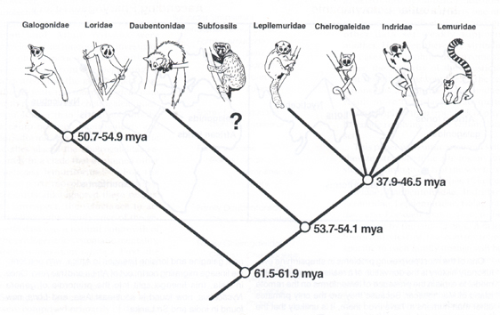
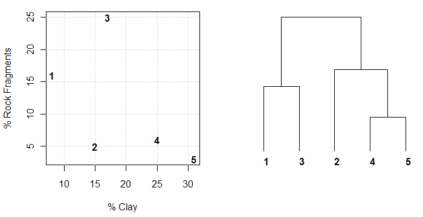
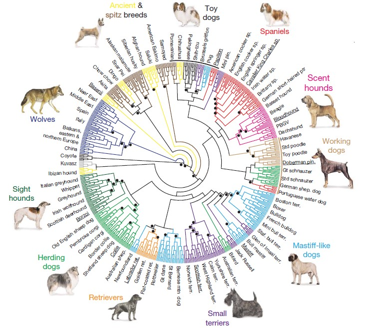
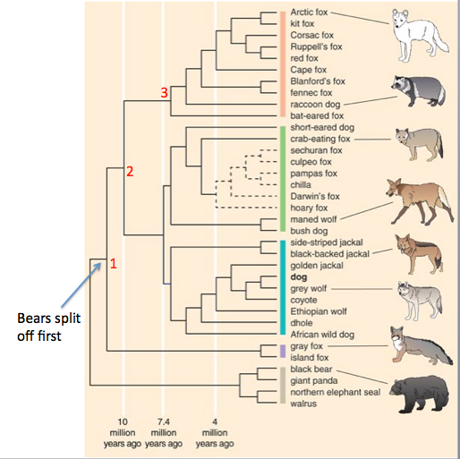
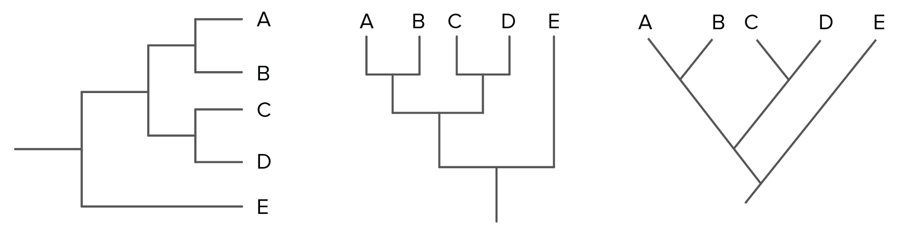
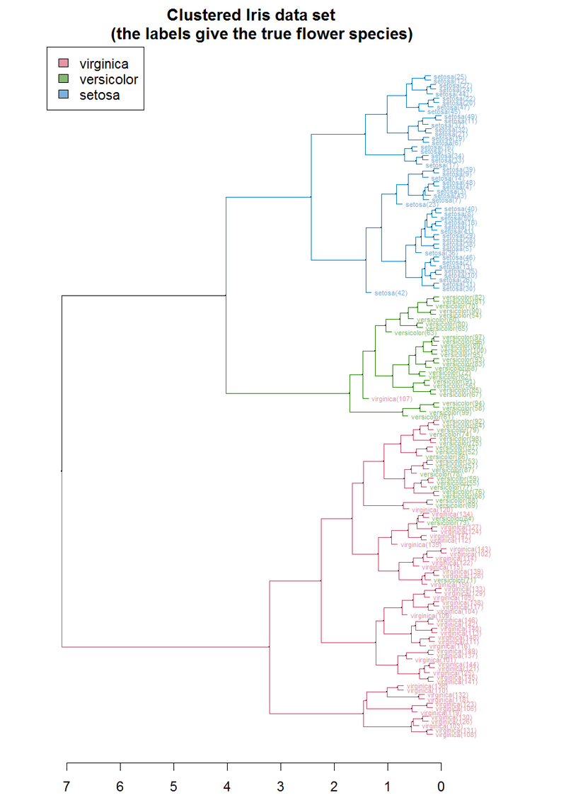

# Dendrogram 

By Raphaël Allier

**Definition**: A dendrogram is a graphical representation of different aggregations made during a cluster analysis. It consists of knots that correspond to groups and branches that represent the associations made at each step. The structure of the dendrogram is determined by the order in which the aggregations are made. [1]
It comes from Greek "dendro" meaning tree, and "gramma", meaning analysis.

## 1. Historical examples 
The first examples of dendrograms were the phylogenetic trees (a tree that shows the inferred evolutionnary relationships among various biological species) by systematic specialists. The term "dendrogram" looks to have been used for the first time in the work of Mayr et al in 1953 [1]. 

__Example of Phylogenetic tree [2]__

Most of the time Dendrograms are used in biology to describe the evolution of species. 

However they are also present in algorithms in cluster analysis. On a set of objects, a dendrogram allows to depict aggregations being made over iterations (the aggregations are made following a distance table that is computed at each iteration). Once all of the instances have been linked through the iterations, the dataset can be cut into clusters where the distance between instances is minimal within a cluster. 

__Example of Dendrogram showing aggregations between instances[3]__

## 2. Recent most famous ones 

The better part of all famous dendrograms are phylogenetic trees, as are the ones below. 

__Phylogenetic tree of domestic dogs and grey wolves[4]__

The previous phylogenetic tree depicts the distance between different dog breeds based on their DNA. 

__Phylogenetic tree of some four-legged animals[5]__

As seen in the previous chart, the dendrogram can also be used to depict the time taken between the aggregation of the instances. In cluster analysis, this is the equivalent of separating different iterations of a clustering algorithm. 

## 3. Comments 

__Creation of a phylogenetic tree[6]__

Usually, phylogenetic tree are created from a dendrogram using simple modifications so they appear more as a chart depicting the evolution of the designated species. 

__Example of clustering on the famous Iris dataset [7]__

As seen in the previous figure, the type of data used to create a dendrogram is simply instances of a dataset. In a dendrogram, we'll generally see an axis showing data points and the other axis showing cluster distance (which can represent distnce in km, time, etc...)

 

__Example of a spiral dendogram with smart ordering [8]__

As you can see in the previous figure, dendrograms can be made more visual when the data is ordered (especially in circular dendrograms). 

## 4. Tools for creating Dendograms

Python has a few tools to create simple dendrograms. 

__Dendrograms using Plotly library [9]__

__Dendrograms using Scipy library [10]__

Dendrograms can be created using the Plotly or Scipy libraries in Python. They can also be created from trees using a function in Matlab : 

__Dendrogram in Matlab [11]__

## 5. Sources

[1] <a href="https://link.springer.com/referenceworkentry/10.1007%2F978-0-387-32833-1_103"> (2008) Dendrogram. In: The Concise Encyclopedia of Statistics. Springer, New York, NY </a>

[2] <a href="http://www-personal.umd.umich.edu/~fdolins/berenty/aboutberenty/fauna/lemurs/_phylogenetictree/index.html"> University of Michigan-Dearborn </a>

[3] <a href="https://casoilresource.lawr.ucdavis.edu/blog/graphical-explanation-how-interpret-dendrogram/">  California Soil Resource lab </a>

[4] <a href="https://www.creative-biostructure.com/custom-phylogenetic-tree-construction-service-399.htm"> Creative Biostructure </a>

[5] <a href="http://www.instituteofcaninebiology.org/how-to-read-a-dendrogram.html"> Institute of Canine biology </a>

[6] <a href="https://www.khanacademy.org/science/biology/her/tree-of-life/a/building-an-evolutionary-tree"> Khanacademy </a>

[7] <a href="https://cran.r-project.org/web/packages/dendextend/vignettes/Cluster_Analysis.html"> Hierarchical cluster analysis on famous data sets by Tal Galili </a>

[8] <a href="http://cs.jhu.edu/~razvanm/fs-expedition/2.6.x.html"> Dendogram of relations between linux files</a>

[9] <a href="https://plot.ly/python/dendrogram/"> Dendrograms in Python </a>

[10] <a href="https://docs.scipy.org/doc/scipy/reference/generated/scipy.cluster.hierarchy.dendrogram.html"> Dendrograms using scipy </a>

[11] <a href="https://fr.mathworks.com/help/stats/dendrogram.html?s_tid=gn_loc_drop"> Dendrogram plot in Matlab </a>

